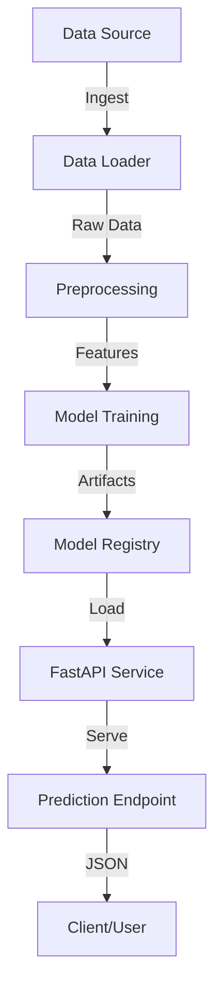

# Telco Customer Churn Prediction Pipeline

This project implements a production-ready Machine Learning pipeline to predict customer churn. It includes data ingestion, preprocessing, model training, and a REST API for serving predictions.

## Architecture



## Structure

- `data/`: Raw and processed data.
- `notebooks/`: Jupyter notebooks for EDA.
- `src/`: Source code for the pipeline.
    - `data_loader.py`: Download/load data.
    - `preprocessing.py`: Feature engineering pipeline.
    - `train.py`: Model training script.
    - `evaluate.py`: Metrics calculation.
    - `config.py`: Configuration settings.
- `app/`: FastAPI application code.
- `tests/`: Unit tests.
- `Dockerfile` & `docker-compose.yml`: Containerization.

## Setup

1. **Clone the repository**
2. **Setup Environment**
   It is recommended to use a virtual environment.
   ```bash
   ```bash
   python -m venv venv
   # Windows (PowerShell):
   .\venv\Scripts\activate
   # Linux/Mac:
   source venv/bin/activate
   
   pip install -r requirements.txt
   ```

   > [!NOTE]
   > **Windows Users**: If you see an error saying "scripts is disabled on this system", you can either:
   > 1. Run python directly: `.\venv\Scripts\python src/train.py`
   > 2. Or allow scripts temporarily: `Set-ExecutionPolicy -Scope Process -ExecutionPolicy Bypass` then try activating again.

## Usage

### 1. Data Pipeline & Training
Run the training script to download data, train the model, and save artifacts.
```bash
python src/train.py
```
This will create `models/model.joblib` and `models/metrics.json`.

### 2. API Serving
Start the FastAPI server:
```bash
uvicorn app.main:app --reload
```
Open [http://localhost:8000/docs](http://localhost:8000/docs) to test the API.

### 3. Docker
Build and run with Docker Compose:
```bash
docker-compose up --build
```

## Testing
Run unit tests:
```bash
pytest tests/
```
