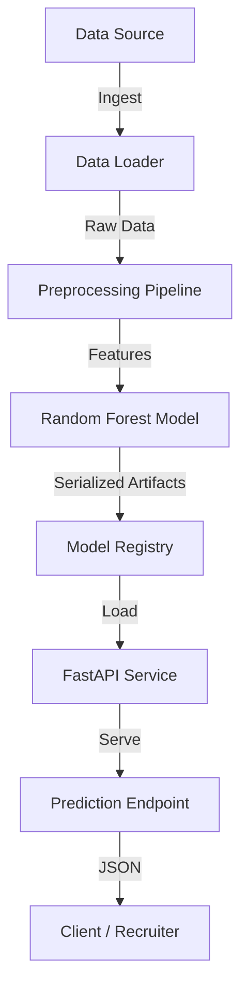

# 📉 Telco Customer Churn Prediction Pipeline


> A production-ready End-to-End Machine Learning project that predicts customer churn using a modular pipeline, served via a REST API.

## 📖 Overview

This project demonstrates a professional MLOps workflow for a binary classification problem (Churn Prediction). Instead of a standalone notebook, it implements a full software lifecycle including:
- **Reproducible Data Pipeline**: Automated ingestion and cleaning.
- **Robust Preprocessing**: Scikit-Learn pipelines for feature engineering.
- **Model Serving**: High-performance API using FastAPI.
- **Containerization**: Fully Dockerized for easy deployment.
- **Testing**: Unit tests for data validity and API endpoints.

## 🚀 Key Features

- **Production-Grade Architecture**: Code is organized into modular components (`src`, `app`, `tests`) rather than monolithic scripts.
- **Automated Data Ingestion**: System automatically downloads the [Telco Customer Churn](https://www.kaggle.com/blastchar/telco-customer-churn) dataset if missing.
- **Type-Safe API**: Uses **Pydantic** schemas for strict input validation, preventing bad data from hitting the model.
- **Interactive Documentation**: Integrated Swagger UI for testing the API in real-time.
- **Docker Integration**: `docker-compose` setup for one-command deployment.
- **CI/CD Ready**: Structure supports easy integration with GitHub Actions (tests included).

## 🛠️ Tech Stack

- **Model**: Scikit-Learn (Random Forest)
- **API**: FastAPI, Uvicorn
- **Data**: Pandas, NumPy
- **Containerization**: Docker, Docker Compose
- **Testing**: Pytest

## 🏗️ Architecture



## 📂 Project Structure

```text
ml-pipeline-project/
├── .github/             # GitHub configurations
├── app/                 # FastAPI Application
│   ├── main.py          # API Endpoints
│   └── schemas.py       # Pydantic Data Models
├── data/                # Data storage (ignored by git)
├── notebooks/           # EDA and Prototyping
├── src/                 # Core ML Logic
│   ├── config.py        # Configuration management
│   ├── data_loader.py   # Data ingestion
│   ├── evaluate.py      # Model metrics
│   ├── preprocessing.py # Feature engineering pipeline
│   └── train.py         # Training script
├── tests/               # Unit Tests
├── Dockerfile           # Docker image definition
├── docker-compose.yml   # Docker services config
└── requirements.txt     # Python dependencies
```

## 💻 Installation & Setup

1. **Clone the repository**
   ```bash
   git clone https://github.com/SrikarK21/telco-churn-ml.git
   cd telco-churn-ml
   ```

2. **Create Virtual Environment**
   ```bash
   python -m venv venv
   ```

3. **Activate & Install Dependencies**
   *Windows:*
   ```powershell
   .\venv\Scripts\activate
   pip install -r requirements.txt
   ```
   *Linux/Mac:*
   ```bash
   source venv/bin/activate
   pip install -r requirements.txt
   ```

   > **Note for Windows Users**: If you encounter a "scripts is disabled" error, run:
   > `Set-ExecutionPolicy -Scope Process -ExecutionPolicy Bypass`

## 🏃 Usage

### 1. Train the Model
This will download data, preprocess it, train the Random Forest, and save the model to `models/model.joblib`.
```bash
python src/train.py
```
*(Windows users can also double-click `run_train.bat`)*

### 2. Start the API Server
Launch the FastAPI server locally.
```bash
uvicorn app.main:app --reload
```
*(Windows users can also double-click `run_api.bat`)*

### 3. Get Predictions
Open your browser to **[http://127.0.0.1:8000/docs](http://127.0.0.1:8000/docs)**.
- Click **"POST /predict"** -> **"Try it out"**.
- Edit the customer JSON data.
- Click **"Execute"** to see the probability of churn.

## 🐳 Docker Deployment

To run the entire system in an isolated container:
```bash
docker-compose up --build
```
The API will be available at `http://localhost:8000`.

## 🧪 Testing

Run the test suite to verify data pipelines and API responses:
```bash
pytest tests/
```

## 📊 Dataset
The dataset used is the [Telco Customer Churn](https://www.kaggle.com/blastchar/telco-customer-churn) dataset from Kaggle.
